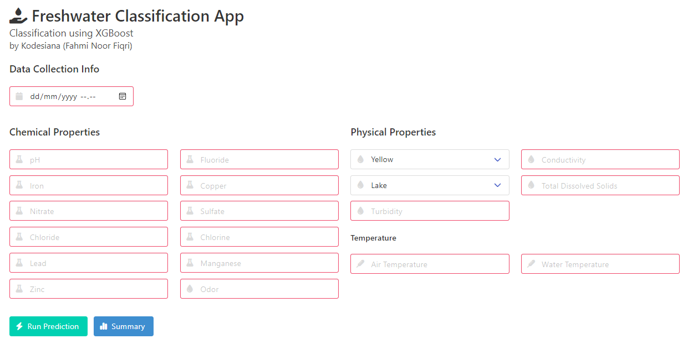

# Challenge 1 - Web App

This challenge 1 project also comes with a web app so you can easily use the model to predict new data, it also provides a simple dashboard to show some key insights from the dataset.

You'll need Docker installed to run the web app (technically you don't need to but this makes the process a lot easier).

## Running the Web App

The most straightforward way if to use Docker. Clone this repo if don't already.

```bash
$ git clone --recurse-submodules https://github.com/fahminlb33/intel-oneapi-hackathon

$ cd intel-oneapi-hackathon/challenge1/app_web

$ docker build -t challenge1:latest .

$ docker run --rm -it -p 8001:8001 challenge1:latest
```

After you run the `docker run` command, you can access the web app at http://localhost:8001.

### Making Predictions

Open the web app at http://localhost:8001, then you will be presented with a form with many inputs and a button to show the dashboard summary.



You can use this sample data point from the dataset to test the web app.

Date: 11 April 2023 04:00 AM

| Field    | Value   | Field     | Value   | Field                  | Value           |
|----------|---------|-----------|---------|------------------------|-----------------|
| pH       | 7.258   | Fluoride  | 1.016   | Color                  | Colorless       |
| Iron     | 0.000   | Copper    | 0.298   | Source                 | River           |
| Nitrate  | 9.261   | Sulfate   | 114.551 | Turbidity              | 0.047           |
| Chloride | 182.242 | Chlorine  | 2.325   | Conductivity           | 160.062         |
| Lead     | 0.000   | Manganese | 0.000   | Total Dissolved Solids | 214.553         |
| Zinc     | 0.416   | Odor      | 3.144   | Water/Air Temperature  | 15.891 / 61.139 |

After you have filled out the form, click **Run Prediction**.


The prediction will be showed in the next page, whether it is safe or not for drinking. The probability will also be shown below the prediction result.

### Dashboard

The dashboard shows us some useful key insights from the dataset. I used the [ApexCharts](https://apexcharts.com/) library to render the charts and the data source is from the JSON files processed using Pandas Modin.


Here you can see some charts such as water color, source, and quality percentage along with time series chart of chemical and physical properties of the water. You can select what chemical to plot using the dropdown and you can set the Y-axis scale from auto to 0 using the checkbox.

## Using the API

I also provide an easy to use API to run your own predictions using REST API.

For each prediction you'll need a unique object key as an ID and each object value's must be an array of each features. The response will results in the same schema, but the array is now the probability of the classification with exactly two elements (`[probability of the good class, probability of the bad class]`).

Note:

1. All categorical features must be encoded as number. Refer to the `paramters.py` for more details
2. Feature column order is the same as in the above example

Using Postman:


Using cURL:

```
$ curl --location 'http://localhost:8001/predict' \
--header 'Content-Type: application/json' \
--data '{
    "single": [
        7.258203145845717,
        6.107129837217062e-09,
        9.26167580122401,
        182.2423407530417,
        4.3998520479124295e-224,
        0.4164775464847408,
        2,
        0.0478031791644083,
        1.0161962374839366,
        0.2980934209430296,
        3.1441986515867457,
        114.55142662349748,
        160.06255735415195,
        2.3250939237169903,
        6.020679600903066e-16,
        214.5531038247008,
        1,
        15.891904856714174,
        61.13914033047329,
        1,
        11.0,
        4.0
    ]
}'

{
    "single": [
        0.5000045723839148,
        0.4999954276160851
    ]
}
```

From the response above we can conclude that the predicted class is 0 (good) because the first element of the result is higher than the second class (>0.5). You can use the `numpy.argmax` to get the classification result in binary.

## Load Tests

The test is performed using the `load_test/test_challenge1.js` on the same PC that runs the server. This is not ideal but can be used roughly to estimate the overall API throughput. The test is performed using K6 with 20 VU for one minute.

| Average | Minimum | Median | Maximum | P(90) | P(95) | Throughput | Total Request |
|---------|---------|--------|---------|-------|-------|------------|---------------|
| 2.61ms  | 971.2µs | 1.75ms | 32.4ms  | 3.35ms| 6.14ms| 19.928/s   | 1200          |

An average of 2.61ms per inference is excellent! This app will surely highly scalable for use in production environment.
