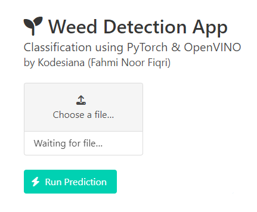
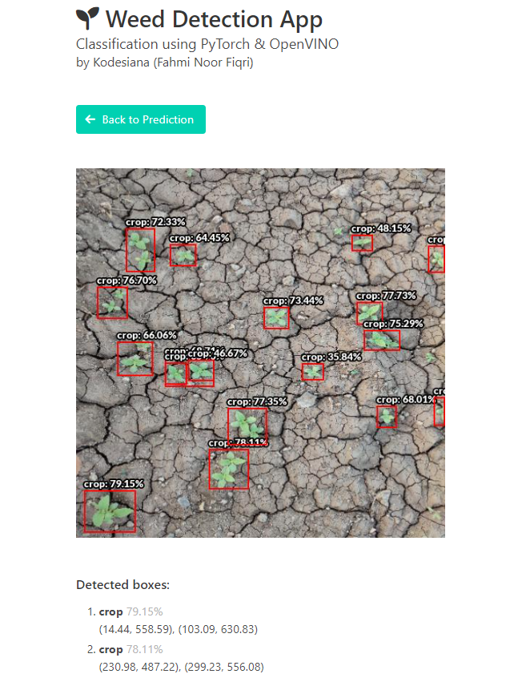
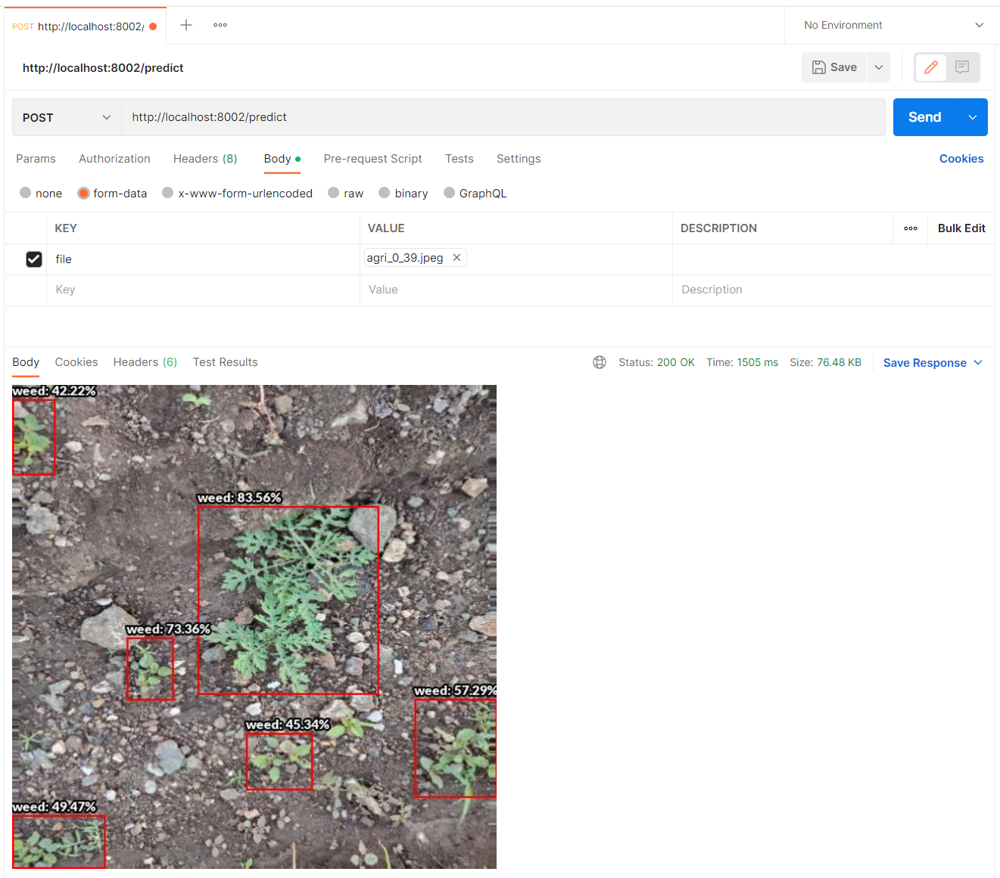

# Challenge 2 - Web App

If you have reached this page, that means you have successfully created your own object detection model using YOLOv5 and have the model in ONNX and OpenVINO format. In this tutorial we will find out about the web app and also the API to execute an inference.

> You'll need **Docker** installed to run the web app!

## Obtaining a Model

You can follow the tutorial on the [readme](./readme.md) or you can also download a pretrained model using the `download_model.sh` script. Simply execute it and it will download all the required model binaries.

## Running the Web App

The most straightforward way if to use Docker Compose. Clone this repo if don't already.

```bash
$ git clone --recurse-submodules https://github.com/fahminlb33/intel-oneapi-hackathon

$ cd intel-oneapi-hackathon/challenge2

$ bash download_model.sh # optional

$ docker-compose up
```

After you run the compose command, you can access the web app at http://localhost:8002. One more notice: port 9000 (OpenVINO gRPC), 9001 (OpenVINO REST), and 8002 (Flask web app) are required to run run the app, if those port are already used, the docker compose will not start.

### Making Predictions

Open the web app at http://localhost:8002, then you will be presented with a single upload button.



Click on the **Choose a file...** then pick a file to process. The result will be shown in the next page.



The prediction will show the annotated image with boxes and confidence in percentage. Below the image all the boxes will be listed with the predicted class, confidence, and it's bounding box.

### Using the API

Along with the API exposed by OpenVINO model serving, I also provided an API which can be used to upload and process the image more easily. Using OpenVINO model serving you still have to preprocess the input image and perform non maximum suppression (NMS) to create a clean bounding box from the YOLOv5 prediction, but using this custom API you can just upload an image and all the preprocessing and NMS process is done automatically.

You can use Postman like this,



Or this cURL command,

```bash
curl --location 'http://localhost:8002/predict' --form 'file=@"agri_0_39.jpeg"'
```

The response will be an image with status code of 200 OK and MIME type of `image/jpeg` when at least one detection is found, and it will return 204 No Content when no bounding box is found.

> Remember to adjust the port to your web app server

## Load Tests

The test is performed using the `load_test/test_challenge2.js` on the same PC that runs the server. This is not ideal but can be used roughly to estimate the overall API throughput. The test is performed using K6 with 20 VU for one minute.

| Scenario                | Average | Minimum | Median | Maximum | P(90) | P(95) | Throughput | Total Request |
|-------------------------|---------|---------|--------|---------|-------|-------|------------|---------------|
| OpenVINO REST           | 2.48s   | 1.03s   | 2.49s  | 4.26s   | 3.06s | 3.26s | 5.525/s    | 348           |
| Web API + OpenVINO REST | 8.21s   | 5.4s    | 7.88s  | 14.52s  | 9.33s | 12.33s| 2.047/s    | 140           |
| Web API + OpenVINO gRPC | 3.24s   | 1s      | 3.32s  | 4.65s   | 3.77s | 3.95s | 4.581/s    | 293           |

UPDATE:

After I reimplemented the prediction using the gRPC protocol (using the `ovmsclient` package) the web app API gains a massive boost from on average of 8.21s per inference down to 3.24s per inference, that's about 60.53% of boost. Upon further inspection on the load test results, the main drawback of the REST API is the used JSON format for image data representation, a single prediction requires the client to process about 25 MB of data! (And the total data processed for the load test is 8.6 GB). This inefficient data transfer and the slow parsing of JSON can be avoided using gRPC + Protobuf format, which makes the API much faster.
